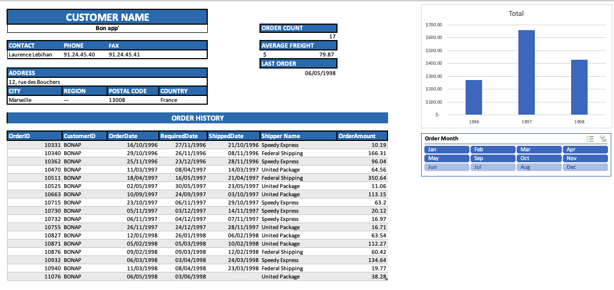
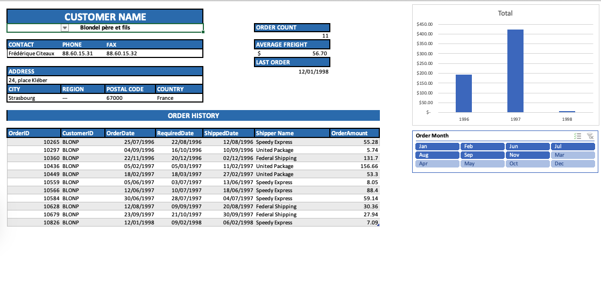
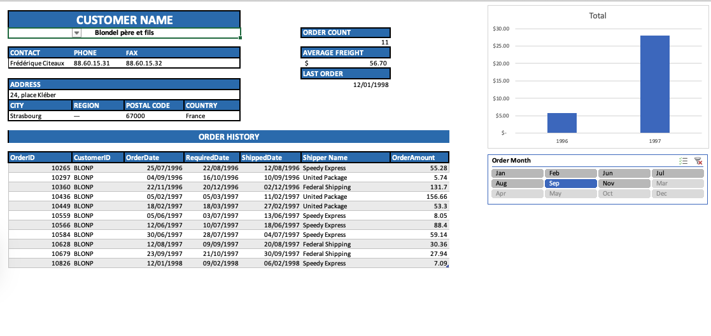
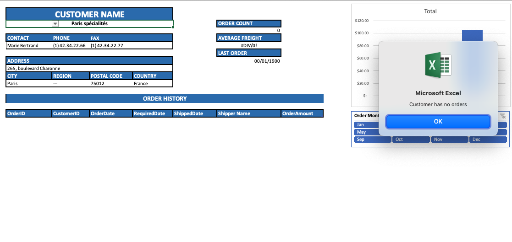
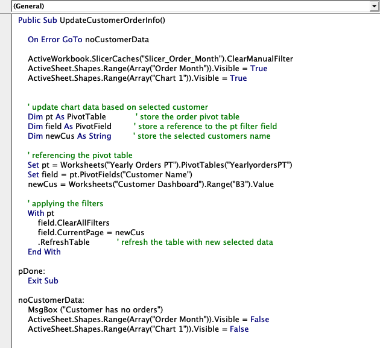

# Customer Order Dashboard — Excel + VBA

An interactive, single-customer reporting dashboard built in **Excel** with **PivotTables, slicers, and VBA automation**. Pick a customer from a dropdown and the entire report — contact details, KPIs, full order history, yearly spend chart, and month filter — rebuilds itself instantly, including graceful handling for customers with no orders.

---

## Dashboard preview

**Customer with full order history (Bon app')**


**Switching customer (Blondel père et fils)**


**Month slicer filtering the chart**


**Edge case — customer has no orders (VBA alert)**


**The VBA refresh routine**


---

## What it does

Selecting a customer name from the dropdown at the top of the dashboard triggers a VBA routine that re-points the underlying PivotTable to that customer and refreshes every linked element on the sheet.

| Component | What it shows |
|-----------|---------------|
| **Customer selector** | Data-validation dropdown driving the whole report |
| **Customer card** | Contact, phone/fax, full address (city, region, postcode, country) |
| **KPI cells** | Order Count, Average Freight, Last Order date |
| **Order History** | Per-order table: OrderID, CustomerID, dates, shipper, order amount |
| **Yearly Total chart** | Total order value by year (1996–1998) |
| **Order Month slicer** | Filters the chart and totals to selected month(s) |

### Key features

- **Single-click customer switching** — choosing a name from the dropdown runs `UpdateCustomerOrderInfo()`, which clears existing filters, sets the PivotTable's page field to the selected customer, and refreshes the data.
- **Slicer-driven filtering** — the *Order Month* slicer lets users narrow the yearly chart to a specific month without touching the data.
- **Live KPIs** — order count, average freight and last-order date recalculate for each customer.
- **Graceful edge-case handling** — if the selected customer has no orders, the macro raises a clear `"Customer has no orders"` message and hides the chart and slicer so the user never sees a broken `#DIV/0!` view.

---

## How it works (technical)

The dashboard is driven by a hidden PivotTable (`YearlyordersPT` on the *Yearly Orders PT* sheet) and a small VBA routine on the dashboard sheet:

```vba
Public Sub UpdateCustomerOrderInfo()
    On Error GoTo noCustomerData

    ActiveWorkbook.SlicerCaches("Slicer_Order_Month").ClearManualFilter
    ' show chart + slicer
    ' re-point the pivot to the selected customer (from the dropdown cell)
    ' refresh

    Exit Sub

noCustomerData:
    MsgBox ("Customer has no orders")
    ' hide chart + slicer
End Sub
```

In plain terms, the routine:

1. Clears any active slicer filter so the new customer starts from a clean view.
2. Reads the selected customer name from the dashboard dropdown cell.
3. Sets that name as the PivotTable's filter (`CurrentPage`) and refreshes the table.
4. Falls into an error handler if there's no data, showing a message and hiding the visual elements.

This combination — **PivotTable backend + slicers + a thin VBA controller** — keeps the report fast and maintainable while behaving like a small interactive app.

---

## Tools & techniques

- **Microsoft Excel** — dashboard layout, KPI design, charting
- **PivotTables** — aggregation engine behind the report
- **Slicers** — interactive month filtering
- **VBA / macros** — automated refresh on customer selection, error handling, conditional visibility of components
- **Data validation** — customer dropdown control

---

## Data

Built on the classic **Northwind** sample dataset — a fictional specialty-foods supplier — using its Customers, Orders, and Shippers tables (customer IDs such as `BONAP` and `BLONP`; shippers Speedy Express, United Package, Federal Shipping).

> The source workbook data is included in this repository.

---

## How to use

1. Open the workbook in **Excel (desktop)** and **enable macros** when prompted.
2. Use the **Customer Name** dropdown at the top of the dashboard to select a customer.
3. The report refreshes automatically — use the **Order Month** slicer to filter the chart by month.
4. Selecting a customer with no order history will display a notification and hide the chart.
